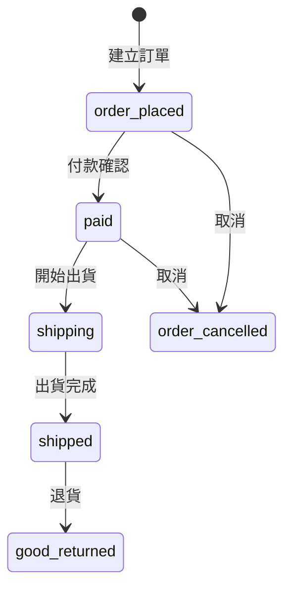

# 任天堂 amiibo 專賣（Demo）

以 Ruby on Rails 8 開發的全端電商網站，
包含商品瀏覽、購物車、訂單管理與後台功能。

專案實作 Devise 驗證、AASM 訂單狀態機、
AWS S3 圖片儲存、Action Mailer 與 i18n 多語系切換。

開發過程中曾遇到 Bootstrap 與 Rails 8 相容性問題，
最終改以 Tailwind CSS 重構前端並完成部署。


---

## 🔗 Links

| | |
|---|---|
| 🌐 Live Demo | [jdstore20260510.onrender.com](https://jdstore20260510.onrender.com/) |
| 📁 GitHub | [github.com/a892842486/amiibo-store](https://github.com/a892842486/amiibo-store) |

> ⚠️ 部署於 Render 免費方案，首次開啟可能需要等待約 30 秒啟動。

## 🔑 Demo Account

| 角色  | Email          | Password |
|-------|----------------|----------|
| Admin | admin@test.com | 123456   |
| User  | user@test.com  | 123456   |

---

## Features

### Storefront（前台）
- 商品列表、詳情瀏覽
- 購物車管理（新增、修改數量、刪除）
- 結帳與訂單建立流程
- 訂單狀態追蹤與歷史查詢
- 使用者註冊 / 登入（Devise）
- Email 訂單通知（下單、出貨、取消）
- 中英文 i18n 多語系切換

### Admin Dashboard（後台）
- 商品 CRUD（含圖片上傳至 AWS S3）
- 訂單列表管理
- 訂單狀態流轉操作（付款確認、出貨、取消）

### Email Notifications（寄信通知）
使用 Action Mailer 實作：
- 下單通知信
- 出貨通知信
- 訂單取消通知
- 管理員取消申請通知
支援訂單資訊與 i18n 多語系信件標題。

### Order State Machine（AASM）

使用 AASM 實作訂單狀態管理，確保狀態流轉的合法性與業務邏輯一致性。



---

## Tech Stack
| 分類 | 技術 |
|------|------|
| Backend | Ruby on Rails 8、PostgreSQL |
| 認證 | Devise |
| 狀態機 | AASM |
| 信件 | Action Mailer |
| 檔案儲存 | Active Storage + AWS S3 |
| Frontend | Tailwind CSS |
| 部署 | Render |

---

## 挑戰與學習

Bootstrap 與 Rails 8 的兼容性問題

在專案初期曾嘗試使用 Bootstrap，
但因 Rails 8 與部分套件版本整合問題，
最終改以 Tailwind CSS 重構前端樣式。

透過此過程學習：
- Rails asset pipeline 設定
- CSS framework 整合方式
- Tailwind utility-first 開發流程

---

## Screenshots

### Storefront

#### 1. Homepage


#### 2. Product Listing


#### 3. Product Details


#### 4. Shopping Cart


#### 5. Checkout


#### 6. Order Details


<details>
<summary>More Screenshots</summary>

### Order Notification

#### 7. Order Confirmation Email


### Admin Dashboard

#### 8. Product Management


#### 9. Order Management


#### 10. Admin Order Details


### Internationalization

#### 11. English UI Preview


</details>

---

## ⚙️ Installation

### 環境需求

- Ruby 3.x（建議 3.2+）
- PostgreSQL
- Node.js（Tailwind CSS 編譯用）

### 步驟

```bash
git clone https://github.com/a892842486/amiibo-store.git
cd amiibo-store
bundle install
```

### 環境變數設定（選填）

本機開發不需要設定即可正常執行。
若需測試 AWS S3 圖片上傳功能，複製範例檔並填入金鑰：

```bash
cp .env.example .env
```

### 啟動

```bash
rails db:create db:migrate db:seed
rails server
```

開啟 [http://localhost:3000](http://localhost:3000)
